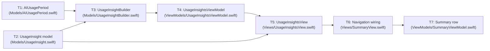

# Execution Plan: AI Usage Insights

Companion to `reviewed-feature-plan.md`. Breaks the feature into standalone, ticket-sized tasks. Unit tests (`UsageInsightBuilderTests.swift` and any new test target) are explicitly **out of scope** for this execution plan — edge-case states are verified via Xcode Previews instead (see T5).

## Scope notes / assumptions

- `Models/UsageInsightBuilder.swift` is added as its own file. The reviewed plan's "Proposed files" list didn't call out a dedicated file for it, but the "Proposed Swift surface" section describes it as a distinct pure rule layer — splitting it out keeps it isolated and independently reasoned-about even without unit tests.
- No standalone "project configuration" task is needed: new Swift files are added directly to the app target as they're created, so file-discovery/target-membership isn't a separate step.
- All tasks assume the resolved decisions and recommendations already captured in `reviewed-feature-plan.md` (10-contributor privacy floor, no cost-derived values, two-card scope, neutral informational styling, existing summary rows untouched, single representative model-mix shift).

---

## Decisions and open questions

Consolidated here from `reviewed-feature-plan.md` and the earlier gap review, so this file is the single place to check before cutting tickets.

### Resolved decisions (from `reviewed-feature-plan.md`)

- **Privacy floor / minimum group size**: An aggregate period must represent at least 10 distinct contributors before the feature may display it. Hard requirement, reflected in T3's `Configuration` and T5's edge-case previews.
- **Permitted aggregate fields**: Model identifiers and reporting-period labels only. No cost-derived values anywhere in the insight flow — this is why T1 defines `AIUsagePeriod` independently of `ModelCostStore` rather than deriving it from `ModelCost.change`.
- **Threshold approval authority**: The product owner approves the thresholds (1,000,000 tokens minimum volume, 15% activity, 10 percentage-point model-mix shift, 10-contributor group-size floor). Numeric sign-off confirmed 2026-09-21 — see Resolved open points below.
- **Final v1 card set**: Approved — exactly two possible cards (activity, model mix). Delivery-context cards stay deferred; no task in this plan builds one.
- **Partial-coverage / informational state presentation**: Neutral styling only — no warning colors, alert icons, or error language. Layout choice (inline caption vs. banner vs. card-style) is left to T5.
- **Ownership of existing summary-screen safety issue**: Out of scope for this feature. T7 only appends a new row; it does not touch, reorder, or rewrite the three existing rows or their causal/individual-ranking copy.
- **Post-v1 model-mix richness**: One representative model-share shift per period is sufficient for v1; no task here builds a richer distribution.

### Implementation recommendations applied (from the earlier gap review)

- **Independent period data model**: T1 adds `AIUsagePeriod` as its own model rather than extending `ModelCostStore`, avoiding the cost/token ambiguity in `ModelCost.change` and keeping cost data out of the insight path.
- **Deterministic date anchoring**: T1's mock periods are anchored to `DashboardStartDate.today` (calendar-month boundaries), consistent with every other store in the app, instead of using an unrelated date source.
- **Edge-case coverage without unit tests**: T5 carries `#Preview` fixtures for insufficient-data, partial-coverage, and no-qualifying-change states, since automated tests are out of scope for this execution plan.
- **Non-invasive summary row**: T7 appends one `Insight` to the existing `built` array with static neutral copy; it does not restructure `SummaryViewModel.Insight` or modify existing rows.

### Resolved open points (confirmed 2026-09-21)

- **Numeric threshold sign-off**: Confirmed. 1,000,000 tokens minimum volume, 15% activity threshold, 10 percentage-point model-mix threshold, and the 10-contributor group-size floor are final for v1 — no longer provisional. T3's `Configuration` can be implemented with these literal values.
- **`UsageInsightBuilder.swift` as a standalone file**: Confirmed as expected. T3 proceeds as its own file; no need to fold the rule logic into `UsageInsightsViewModel.swift`.

---

## Task breakdown

### T1 — Add AI usage period data model

- **Files:** `Models/AIUsagePeriod.swift` (new)
- **Description:** Add an `AIUsagePeriod` struct (start/end dates, completion status, aggregate total tokens, token totals by stable model identifier) and a small store supplying exactly two fixed, deterministic periods — the reporting period and its immediately preceding equal-length period — anchored to `DashboardStartDate.today` (calendar-month boundaries). Independent of `ModelCostStore`; contains no cost-derived values, per the resolved privacy decision.
- **Depends on:** None.

### T2 — Add usage insight domain model

- **Files:** `Models/UsageInsight.swift` (new)
- **Description:** Add `UsageInsight` (category-based identity, title, evidence, review prompt, reporting-period label, optional display-only trend direction — no individual, ticket, prompt, cohort, or cost data), `UsageInsightCategory` (`activity`, `modelMix`), and `UsageInsightsState` (`insights`, `noQualifyingChanges`, `insufficientData`, with enough info to support a neutral partial-coverage note).
- **Depends on:** None.

### T3 — Add usage insight rule builder

- **Files:** `Models/UsageInsightBuilder.swift` (new)
- **Description:** Add `UsageInsightBuilder`, a pure, deterministic type that takes two `AIUsagePeriod` values and a `Configuration` (minimum volume 1,000,000 tokens, minimum group size 10 contributors, activity threshold 15%, model-mix threshold 10 percentage points, alphabetical tie-breaker, max 2 cards) and returns a `UsageInsightsState`. Implements the AI-activity and model-mix comparison rules and suppresses categories with missing, negative, non-finite, or incomplete data. No I/O, no LLM calls, no persistence.
- **Depends on:** T1, T2.

### T4 — Add usage insights view model

- **Files:** `ViewModels/UsageInsightsViewModel.swift` (new)
- **Description:** Add `UsageInsightsViewModel`, which supplies the two local `AIUsagePeriod` values to `UsageInsightBuilder` and exposes the resulting `UsageInsightsState` for the view to render. Receives only local aggregate period inputs; no networking, no persistence.
- **Depends on:** T3.

### T5 — Add usage insights view

- **Files:** `Views/UsageInsightsView.swift` (new)
- **Description:** Add `UsageInsightsView`: navigation title "AI Usage Insights", helper text framing content as team-level review prompts, up to two compact cards in stable order (activity, then model mix), the insufficient-data state, the no-qualifying-changes state, and the neutral partial-coverage note. All informational states use neutral styling only — no warning colors, alert icons, or error language. Supports Dynamic Type, and VoiceOver labels include category, observed comparison, and reporting-period context without exposing prohibited data. Add `#Preview` fixtures for: two qualifying cards, one qualifying card with one unavailable category (coverage note), no-qualifying-changes, and insufficient data (below minimum volume/group size) — these previews are the primary way to verify edge-case states since unit tests are out of scope.
- **Depends on:** T2, T4.

### T6 — Wire navigation destination

- **Files:** `Views/SummaryView.swift` (modify)
- **Description:** Add a `.usageInsights` case to `DestinationGraph` and a corresponding case in the `navigationDestination(for:)` switch that presents `UsageInsightsView()`. No changes to existing cases or rows.
- **Depends on:** T5.

### T7 — Add summary row

- **Files:** `ViewModels/SummaryViewModel.swift` (modify)
- **Description:** Append one new `Insight` to the existing `built` array with neutral copy ("AI Usage Insights" / "Review aggregate team AI usage patterns.") and `destination: .usageInsights`. Does not modify, reorder, or remove the three existing rows or their copy.
- **Depends on:** T6.

---

## Parallelization and dependencies

**Can run in parallel:** T1 and T2 only — they touch unrelated, brand-new files with no shared types.

**Sequential from there:** T3 → T4 → T5 → T6 → T7 form a strict chain, since each layer's public type is consumed by the next (rule builder → view model → view → navigation wiring → summary row). This is inherent to the layered architecture, not an artificial constraint — there isn't a way to parallelize further without one task guessing at another's not-yet-defined interface.

```text
T1 (AIUsagePeriod) ──┐
                      ├──▶ T3 (UsageInsightBuilder) ──▶ T4 (ViewModel) ──▶ T5 (View) ──▶ T6 (Navigation) ──▶ T7 (Summary row)
T2 (UsageInsight)  ──┘
```


